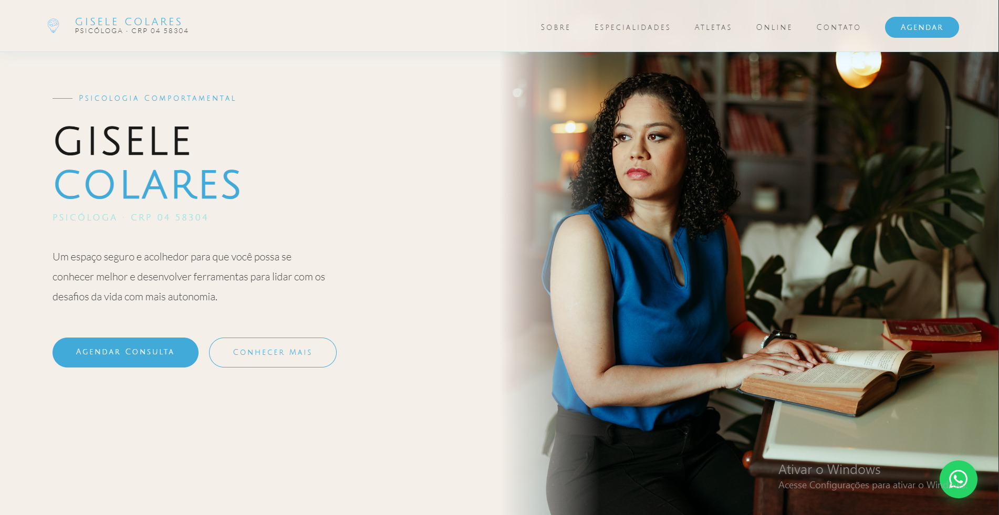
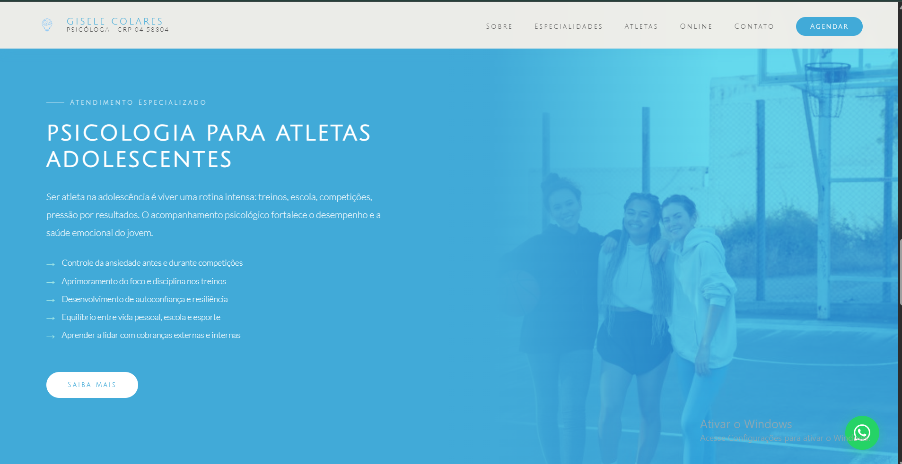
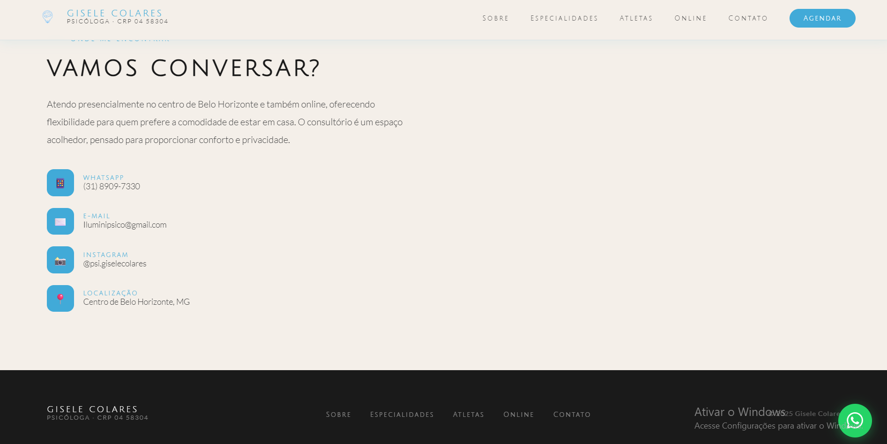
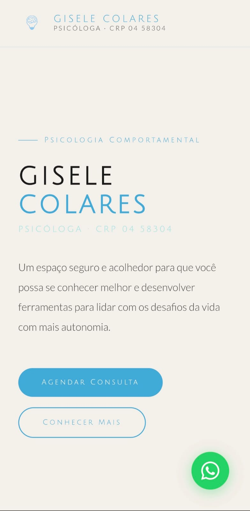
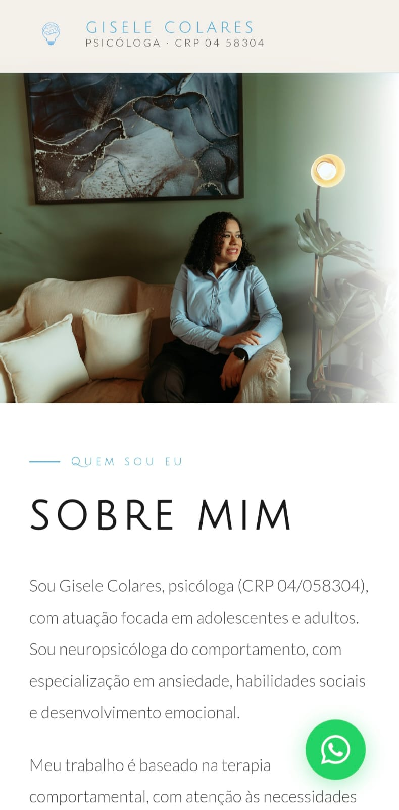
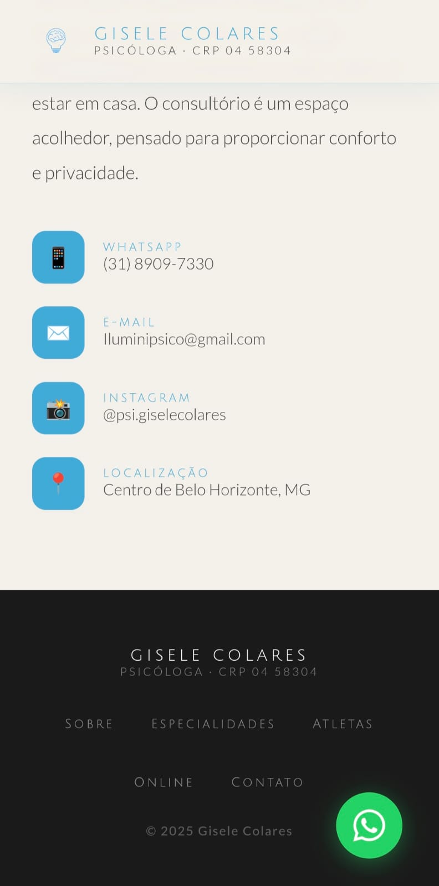

# Site Psicologa Gisele Colares 

> Pagina web usada como portifolio
> https://giselecolares.online/

---

##  Sobre o projeto

Projeto criado a partir da necessidade de promoção da profissional por meio de chamadas na web, o site apresenta a profissional da área da psicologia que facilita o contato para pessoas de presciam de atendimento, trazendo como diferencial uma identidade visual clara e tranquila que comunica segurança e acoçhimento aos novos pascientes.

--- 

##  Tecnologias utilizadas

- CSS
- HTML
- JavaScript 

---

##  Preview
  

  

